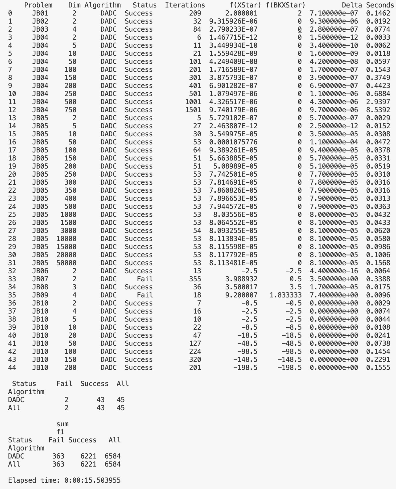

[](https://pubsonline.informs.org/journal/ijoc)

# [DADC: The descent-ascent algorithm for DC programming](https://doi.org/10.1287/ijoc.2023.0142)


This archive is distributed in association with the [INFORMS Journal on
Computing](https://pubsonline.informs.org/journal/ijoc) under the [MIT License](LICENSE).

The software and data in this repository are a snapshot of the software
that were used in the research reported on in the paper 
[DADC](https://doi.org/10.1287/ijoc.2023.0142). 
The snapshot is based on 
[this SHA](https://github.com/xedla/DADC/commit/9807f88004f7b74b3e989015ad6b9b612563e49a)
in the development repository. 

**Important: This code is being developed on an on-going basis at 
https://github.com/xedla/DADC. Please go there if you would like to
get a more recent version or would like support**

## Cite

To cite the contents of this repository, please cite both the paper and this repo, using their respective DOIs.

https://doi.org/10.1287/ijoc.2023.0142

https://doi.org/10.1287/ijoc.2023.0142.cd

Below is the BibTex for citing this snapshot of the repository.

```
@article{CacheTest,
  author =        {Pietro D’Alessandro, Manlio Gaudioso, Giovanni Giallombardo, Giovanna Miglionico},
  publisher =     {INFORMS Journal on Computing},
  title =         {{DADC: he descent-ascent algorithm for DC programming}},
  year =          {2023},
  doi =           {10.1287/ijoc.2023.0142.cd},
  url =           {https://doi.org/10.1287/ijoc.2023.0142},
}  
```

## Description

This repository contains the code to run the experiments present in "The descent-ascent algorithm for DC programming", a bundle method for the unconstrained minimization of nonsmooth difference-of-convex functions. 

## Install
It is needed python 3.11 or above.

Clone or download repository and run shell command as follow:

```
sh ./scripts/install.sh
```

This script install specific packages versions in a python virtualenv.

## Run experiment

Execute the command line:

```
python3 ./scripts/runme.py
```
csv file experiment results will be available in 'csv' folder.
## Results
In image below is run result on Apple MacBook Pro 14 mid 2021 with processor Apple silicon M1 Pro.
Python 3.11.5 interpreter.




## Ongoing Development

This code is being developed on an on-going basis at the author's
[Github site](https://github.com/xedla/DADC).

## Support

For support in using this software, submit an
[issue](https://github.com/xedla/DADC/issues/new).

# AlgorMeter
DADC algorithm is based on AlgorMeter package.  
Algormeter is a Python framework for developing, testing, and measuring optimizers algorithms. It provides a standard library of DC and convex functions for testing algorithms. It can be used to run experiments with different algorithms and problems, and produce comparative measures and performance profiles graph. Algormeter can also optimize the number of function calls, so that multiple calls at the same point are counted only once.  It can perform algorithm parameter tuning.  
Description is at https://github.com/xedla/algormeter/blob/master/README.md   
It is available as pypi package
```
pip install algormeter
```

Development repository is at https://github.com/xedla/algormeter  